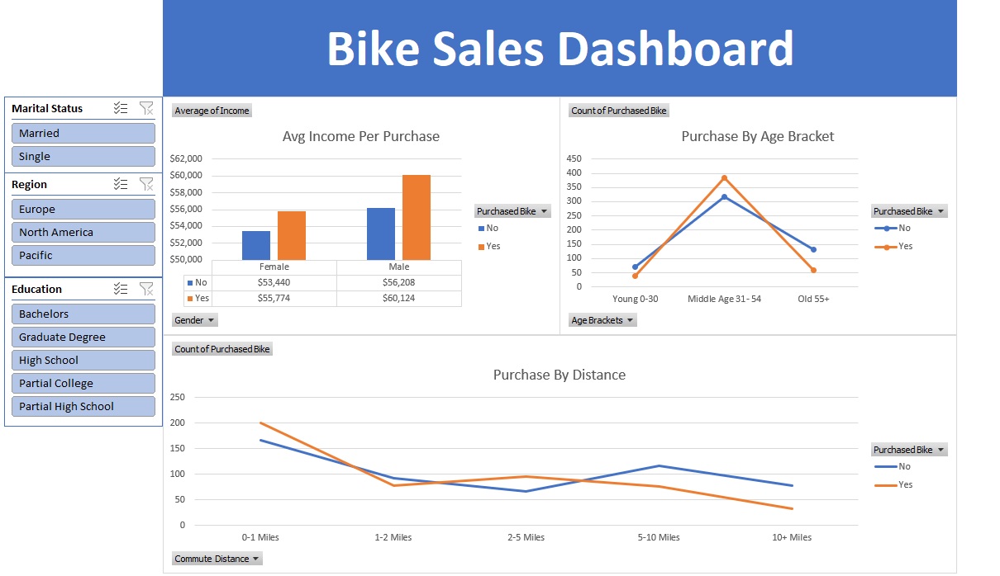

# Customer Purchase Behavior Analysis – Excel Dashboard

## Project Overview

This project analyzes a customer dataset to identify demographic and socioeconomic factors influencing bike purchase decisions.

The workflow follows a structured data analysis pipeline:

Raw Data → Data Cleaning → Feature Engineering → Pivot Analysis → Dashboard Visualization

---

## Dataset

- 1,026 customer records (raw dataset)
- 13 original variables
- Target variable: `Purchased Bike` (Yes/No)

Variables include:

- Age
- Gender
- Marital Status
- Income
- Education
- Occupation
- Commute Distance
- Home Ownership
- Region

---

## Data Preparation

The following cleaning and transformation steps were performed:

- Removed duplicate records
- Standardized categorical variables (M/F → Male/Female, S/M → Single/Married)
- Created a new feature: Age Brackets
- Preserved the raw dataset by performing transformations in a separate sheet

The cleaned dataset was structured to be analysis-ready for aggregation and reporting.

---

## Analysis and Dashboard

Using Excel Pivot Tables and calculated fields, a dashboard was developed to explore:

- Purchase behavior by age group
- Income distribution vs purchase decision
- Gender and marital status impact
- Commute distance influence
- Regional differences

The dashboard provides a business-oriented view of demographic drivers behind product purchases.

---

## Tools Used

- Microsoft Excel
  - Data Cleaning
  - Pivot Tables
  - Feature Engineering
  - Dashboard Design

---

## Objective

The purpose of this project was to demonstrate:

- Structured data preparation
- Categorical normalization
- Feature engineering
- Analytical thinking
- Business-focused dashboard development

