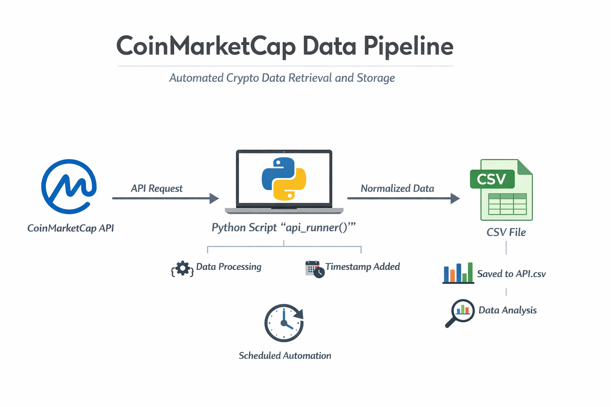

# CoinMarketCap Data Pipeline




## Project Overview
This project automates the retrieval of cryptocurrency data from the CoinMarketCap API and stores it in a CSV file for analysis. It is designed to run continuously, updating the dataset at regular intervals.

## Features
- **API Integration:** Fetches the latest cryptocurrency listings from CoinMarketCap.
- **Data Normalization:** Converts JSON responses into a structured pandas DataFrame.
- **Timestamping:** Adds the current timestamp to track when each data snapshot was retrieved.
- **CSV Storage:** Automatically appends new data to a CSV file, creating it if it doesn't exist.
- **Automation:** Runs the API call in a loop, pausing between requests to continuously update the dataset.

## Technologies Used
- Python 3.x
- `requests` for API calls
- `pandas` for data manipulation
- `json` for parsing API responses
- `os` for file handling
- `time` for scheduling periodic data pulls

## How It Works
1. The `api_runner()` function calls the CoinMarketCap API using a session with appropriate headers.
2. The JSON response is normalized into a pandas DataFrame.
3. A timestamp column is added to indicate when the data was retrieved.
4. The DataFrame is either saved as a new CSV or appended to an existing CSV file.
5. A loop runs this function repeatedly with a 1-minute pause between calls.

## Usage
1. Replace `X-CMC_PRO_API_KEY` in the headers with your own CoinMarketCap API key.
2. Set the file path in `df.to_csv()` to your desired location.
3. Run the script to start automated data collection.

```python
for i in range(333):
    api_runner()
    print('API Runner completed')
    sleep(60)  # 1-minute pause between API calls

