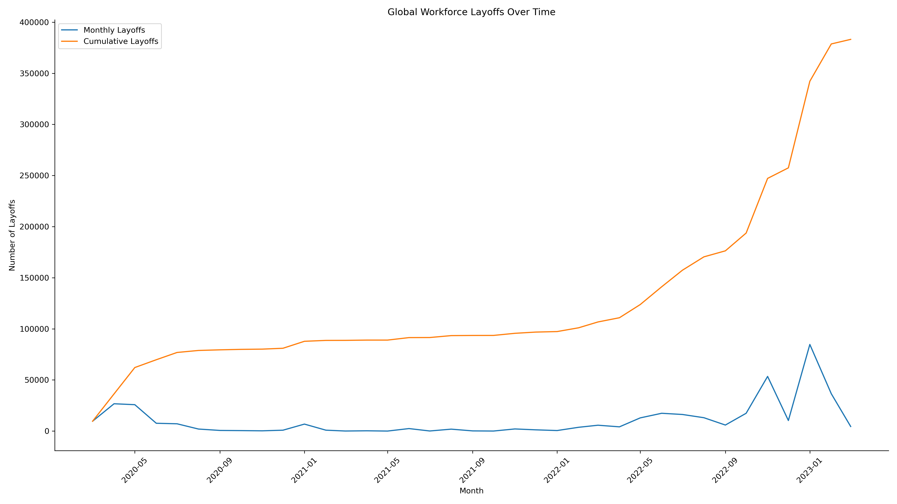

# Global Workforce Layoffs – SQL Analysis

## Overview
This project involves end-to-end data cleaning and exploratory data analysis of global workforce layoff data using SQL.

The objective was to transform raw data into a structured, analysis-ready dataset and identify company-level and time-based layoff trends.

---

## Tools Used
- MySQL
- SQL (Window Functions, CTEs, Aggregations)

---

## Data Cleaning Process
- Created staging tables to preserve raw data integrity
- Removed duplicate records using `ROW_NUMBER()`
- Standardized categorical fields (company, industry, country)
- Converted string-based dates into proper DATE format
- Handled null and missing values
- Imputed missing industry values via self-join

---

## Exploratory Data Analysis
- Identified companies with highest total layoffs
- Analyzed layoffs by funding stage
- Evaluated time-based trends (monthly aggregation)
- Calculated rolling cumulative layoffs using window functions
- Ranked top companies per year using `DENSE_RANK()`

---

## Key Focus
The project emphasizes data integrity, structured transformation, and analytical trend evaluation using SQL.

## Layoff Trend Over Time

